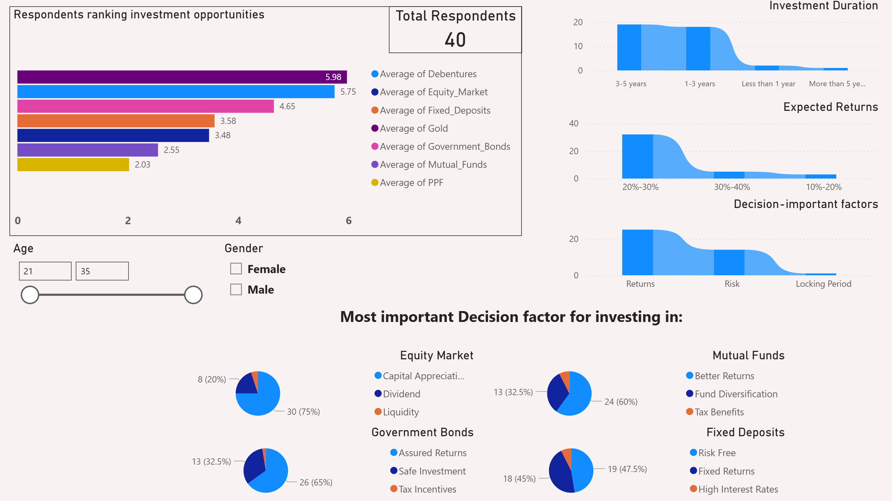
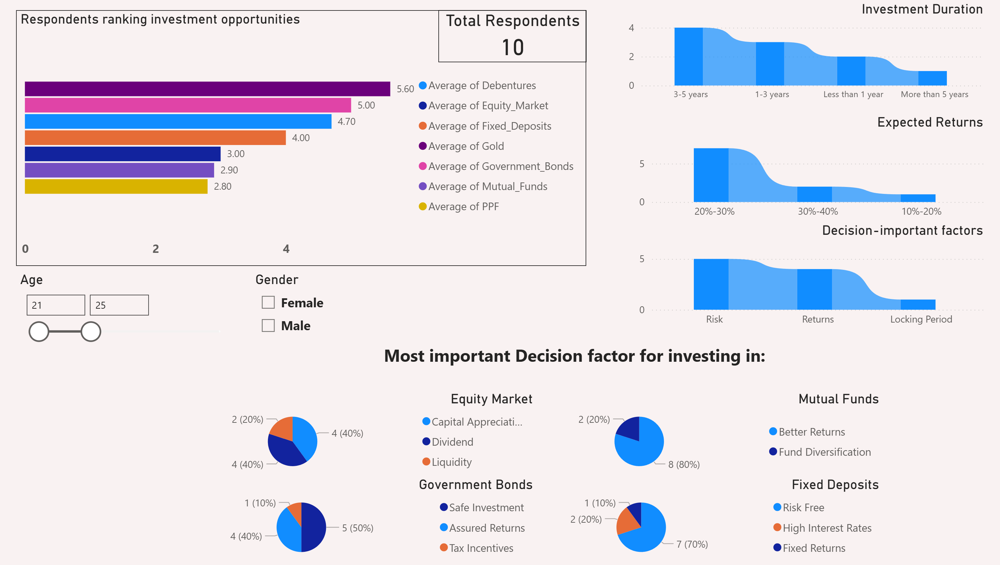

# Finance Investment Questionary EDA 

## Project Summary

This project analyzes a financial questionnaire dataset to understand how demographic factors, especially gender and age, influence investment preferences, financial goals, and decision-making behavior.

Using MySQL, Python, and Power BI, I explored survey responses, compared investment preferences across respondent groups, and identified patterns that can support customer segmentation, marketing strategy, product positioning, and financial advisory insights.

## Business Questions

- Which investment options are most appealing to respondents by gender?
- Which investment options are most appealing to younger respondents aged 25 or below?
- How many respondents are interested in stock market investing and general investment avenues?
- Which factors most influence respondents when choosing investment instruments?
- What are the most common investment objectives, expected returns, investment horizons, and information sources?

## Key Findings & Insights

### Key Findings

- Total respondents: 40.
- Gender distribution: 25 male respondents and 15 female respondents.
- Respondent age range: 21 to 35 years old.
- The dataset contains 24 survey-response columns covering demographics, investment preferences, objectives, expected returns, monitoring frequency, and information sources.
- Most respondents indicated interest in investment avenues and stock market-related investing.
- Mutual Funds and Public Provident Fund were among the most preferred investment avenues across respondent groups.
- Younger respondents aged 25 or below showed interest in Equity Market investments in addition to more traditional investment options.
- The small sample size means the findings should be interpreted as exploratory insights, not statistically representative conclusions.

### Key Insights

| Analysis Area | Key Insight | Business Relevance |
|---|---|---|
| Respondent Profile | The sample includes 40 respondents aged 21–35, with more male than female respondents | Helps define the demographic scope and limitations of the analysis |
| Investment Interest | Most respondents show interest in investment avenues and stock market participation | Indicates potential demand for investment products and advisory services |
| Investment Preferences | Mutual Funds and Public Provident Fund appear among the most attractive investment options | Supports product positioning around relatively familiar or trusted investment instruments |
| Young Respondents | Respondents aged 25 or below show interest in Equity Market options alongside other investment avenues | Suggests potential for youth-focused financial education and equity-investing campaigns |
| Decision Factors | Respondents differ in investment goals, expected returns, time horizon, and information sources | Helps tailor marketing messages and advisory recommendations by customer segment |


## Business Impact

This project demonstrates how survey-based financial data can support customer segmentation, investment product positioning, and marketing strategy development.

- **Customer segmentation:** Gender and age-based analysis helps identify how different respondent groups approach investment decisions.
- **Product positioning:** Investment preference rankings can help highlight which instruments, such as Mutual Funds, Public Provident Fund, Equity Market, or Fixed Deposits, may be more appealing to specific groups.
- **Marketing strategy:** Understanding respondents’ goals, expected returns, and information sources can help design more relevant financial education and promotional campaigns.
- **Advisory support:** Analysis of decision factors can help financial advisors better understand what clients value when selecting investment products.
- **Executive reporting:** The Power BI dashboard makes survey insights easier to review for non-technical stakeholders.

Overall, this project shows how SQL, Python, and Power BI can turn questionnaire responses into practical insights for financial services, marketing, and customer advisory teams.

## Business Recommendations

- Develop targeted marketing campaigns for investment products based on age and gender segments.
- Promote Mutual Funds and Public Provident Fund as broadly appealing investment options among surveyed respondents.
- Create beginner-friendly Equity Market education content for younger respondents.
- Use respondents’ preferred information sources to optimize marketing and advisory communication channels.
- Investigate underrepresented or less preferred investment products to understand whether low interest is caused by risk perception, low awareness, or lack of product knowledge.
- Treat findings as exploratory and validate them with a larger respondent sample before making high-impact business decisions.

## Limitations

- The dataset contains only 40 survey responses, so results should be interpreted as exploratory rather than statistically representative.
- The analysis is based on the available questionnaire data and may not reflect broader market behavior.
- The dataset does not include external financial context such as income, geography, education level, or actual investment balances.
- Survey responses indicate preferences and intentions, not confirmed investment behavior.
- Some findings may require deeper segmentation or a larger sample size for stronger business conclusions.

## Tools Used

- MySQL
- Python
- pandas
- matplotlib
- seaborn
- SQLAlchemy
- Power BI

## Project Deliverables

- SQL analysis scripts
- Python data-loading and visualization script
- Exported charts
- Power BI dashboard screenshots
- Power BI `.pbix` dashboard file
- Dataset documentation

## Methodology

### Phase 1 - Data Understanding and Preparation

**Goal:** Understand the dataset structure and prepare the survey data for analysis in MySQL.

**Tasks completed:**
- Validated table structure and column definitions.
- Reviewed respondent demographic fields.
- Checked missing values and general data consistency.
- Collected overall dataset statistics, including:
  - total respondents,
  - gender distribution,
  - age range,
  - number of survey-response columns.
- Standardized column names for easier SQL and Python analysis.

### Phase 2 - Gender- and age-based investment avenues analysis

**Goal:** Analyze how investment preferences differ by gender and age group.

**Techniques used:**
- Grouped aggregations.
- Conditional aggregations.
- Gender-based comparison.
- Age-group filtering for respondents aged 25 or below.
- Average ranking analysis for investment instruments.
- Visualization of investment preferences by respondent group.

### Phase 3 -  Gender-based questions about investment analysis

**Goal:** Identify the most common factors influencing investment choices and compare responses by gender.

**Techniques used:**
- Common Table Expressions, or CTEs.
- Percentage calculations by gender.
- Most-common-response analysis.
- Comparison of investment objectives, expected returns, investment duration, monitoring frequency, and information sources.
- Visualization of the most common survey responses by respondent group.

## Dashboard & Data Visualization

An interactive Power BI dashboard was developed to summarize questionnaire results, investment preferences, respondent demographics, and key decision factors.

### Dashboard Preview

This dashboard summarizes the main questionnaire insights for business users, including investment preferences, respondent characteristics, and key factors influencing investment decisions.



#### Young Respondents Dashboard Preview

This dashboard view focuses on respondents aged 25 or below and highlights investment preferences among younger survey participants.



### Interactive File
The Power BI `.pbix` file is available in
`/data/dashboards/power_bi/fd_investing_factors_dashboard.pbix`

*To explore the dashboard, download and open it in Power BI Desktop.*

### Data Visualization Preview

This visualization highlights investment preference patterns across respondent groups.

This visualization summarizes the most common investment-related responses by gender.

## Repository Structure
```text
EDA_fin_questionary_analysis/
├── README.md
├── requirements.txt
├── .env.example
├── .gitignore
├── LICENSE
├── data/
│   ├── dataset_description.md
│   ├── sql/
│   ├── src/
│   ├── notebooks/
│   ├── images/
│   └── dashboards/
│       ├── power_bi/
│       └── screenshots/
```

### Folder Details
- `data/sql/` - SQL scripts used for data preparation and analysis.
- `data/src/` - Python scripts for database connection, data loading, and plotting.
- `data/notebooks/` - Jupyter notebooks used for exploratory investigation and plotting.
- `data/images/` - Exported charts used in the README and reporting.
- `data/dashboards/power_bi/` - Power BI `.pbix` dashboard file.
- `data/dashboards/screenshots/` - Dashboard screenshots used in the README.
- `data/dataset_description.md` - Dataset schema and source description.

## How to Run This Project

### 1. Clone the repository

```bash
git clone https://github.com/NikolayKotovanalytics/EDA_fin_questionary_analysis.git
cd EDA_fin_questionary_analysis
```

### 2. Create and activate a virtual environment

**Windows**
```bash
python -m venv venv
venv\Scripts\activate
```

**macOS / Linux**
```bash
python -m venv venv
source venv/bin/activate
```

### 3. Install project dependencies

```bash
pip install -r requirements.txt
```

### 4. Download the dataset

This project uses the public **Finance Data Dataset** from Kaggle.

Download it from Kaggle at: [Finance Data Dataset](https://www.kaggle.com/datasets/nitindatta/finance-data/data)

Raw data is not included in this repository due to licensing constraints.

See `/data/dataset_description.md` for full dataset schema and details.

### 5. Create the MySQL database and import the dataset tables

```sql
CREATE DATABASE finance_dataset;
```
Then import the dataset table into that database.

### 6. Configure database credentials

Create a `.env` file in the project root:

```env
DB_HOST=localhost
DB_PORT=3306
DB_NAME=finance_dataset
DB_USER=your_username
DB_PASSWORD=your_password
```

See the `.env.example` file for an example of its content.

### 7. Run scripts and review outputs

SQL analysis scripts are located in: `data/sql/`

Recommended order:
1. `Phase_1_create_dataset_and_preliminary_analysis.sql`
2. `Phase_2_gender_and_age_based_investment_preferences_analysis.sql`
3. `Phase_3_analysis_of_factors_influencing_investment_preferences.sql`

### 8. Run scripts and review outputs 

After the database is set up, run the Python scripts in `data/src/` to load data and generate charts:

```bash
python data/src/db_upload_and_plotting_images.py
```
- Visualizations: `data/images/` 

## Acknowledgements / AI Assistance

AI tools such as ChatGPT (OpenAI) were used for code review, debugging, and documentation refinement. 

All analysis design, interpretation of results, and final implementation decisions were performed by the author.
